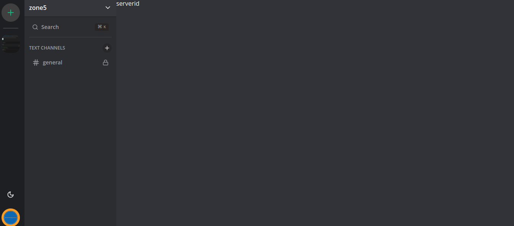
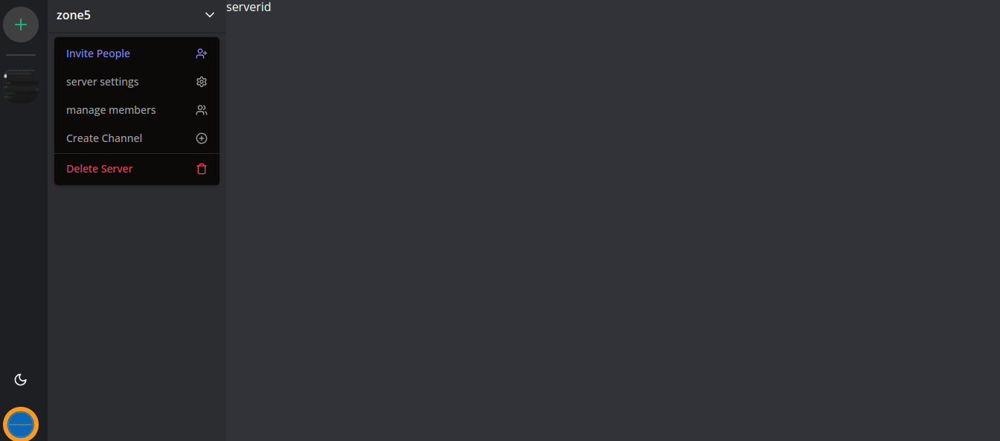
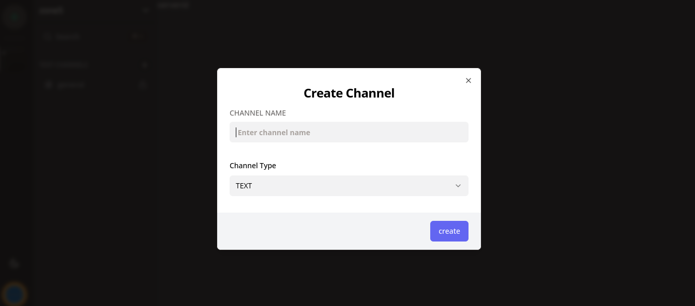

<p align="center" id="readme-top" >
<a href="https://www.npmjs.com/~nestjscore" target="_blank"></a>
<a href="license.txt" target="_blank"></a>
<a href="https://discord.gg/j4dkUGm2" target="_blank"></a>
<a href="https://www.buymeacoffee.com/kamaumungad" target="_blank"></a>
<a align="center" href="https://twitter.com/Naval29193321" target="_blank"></a>

</p>

<!-- images description -->





<!-- setup -->

## Setup
 ### set in .env file

    NEXT_PUBLIC_CLERK_PUBLISHABLE_KEY=
    CLERK_SECRET_KEY=
    NEXT_PUBLIC_CLERK_SIGN_IN_URL=
    NEXT_PUBLIC_CLERK_SIGN_UP_URL=
    NEXT_PUBLIC_CLERK_AFTER_SIGN_IN_URL=
    NEXT_PUBLIC_CLERK_AFTER_SIGN_UP_URL=
    DATABASE_URL=
    UPLOADTHING_SECRET=
    UPLOADTHING_APP_ID=
    
This is a [Next.js](https://nextjs.org/) project bootstrapped with [`create-next-app`](https://github.com/vercel/next.js/tree/canary/packages/create-next-app).


<!-- todos --> 
## Todos
- [x] create channels
- [x] add channel invites
- [x] add channel members
- [ ] add channel messages
- [ ] add channel message reactions
- [ ] add channel message replies
- [x] search channels
- [x] server settings
- [ ] server members
- [x] manage server members
- [x] server invites
- [ ] server bans
- [x] server roles
- [ ] server emojis
- [ ] server integrations
- [ ] server moderation
- [ ] 


## Getting Started

First, run the development server:

```bash
npm run dev
# or
yarn dev
# or
pnpm dev
```

Open [http://localhost:3000](http://localhost:3000) with your browser to see the result.

You can start editing the page by modifying `app/page.tsx`. The page auto-updates as you edit the file.

This project uses [`next/font`](https://nextjs.org/docs/basic-features/font-optimization) to automatically optimize and load Inter, a custom Google Font.

## Learn More

To learn more about Next.js, take a look at the following resources:

- [Next.js Documentation](https://nextjs.org/docs) - learn about Next.js features and API.
- [Learn Next.js](https://nextjs.org/learn) - an interactive Next.js tutorial.

You can check out [the Next.js GitHub repository](https://github.com/vercel/next.js/) - your feedback and contributions are welcome!

## Contact

- Author - [linkedin-link]
- Website - [Website]
- Twitter - [Twitter]

## Acknowledgments

Useful links and resources I used to create this project:
   - Youtube video [AntonioYoutube]
   - mongodb [MongoDB](https://www.mongodb.com/)

<!--
* [YouTube Video](https://www.youtube.com/watch?v=2n3xS89TJMI)
* [swagger](https://swagger.io/) -->

<p align="right">(<a href="#readme-top">back to top</a>)</p>


[BuyCoffee]: https://img.shields.io/badge/buy_coffee-mungaben-brownish
[contributors-shield]: https://img.shields.io/github/contributors/othneildrew/Best-README-Template.svg?style=for-the-badge
[contributors-url]: https://github.com/othneildrew/Best-README-Template/graphs/contributors
[forks-shield]: https://img.shields.io/github/forks/othneildrew/Best-README-Template.svg?style=for-the-badge
[forks-url]: https://github.com/othneildrew/Best-README-Template/network/members
[stars-shield]: https://img.shields.io/github/stars/othneildrew/Best-README-Template.svg?style=for-the-badge
[stars-url]: https://github.com/othneildrew/Best-README-Template/stargazers
[issues-shield]: https://img.shields.io/github/issues/othneildrew/Best-README-Template.svg?style=for-the-badge
[issues-url]: https://github.com/othneildrew/Best-README-Template/issues
[license-shield]: https://img.shields.io/github/license/othneildrew/Best-README-Template.svg?style=for-the-badge
[license-url]: https://github.com/othneildrew/Best-README-Template/blob/master/LICENSE.txt
[linkedin-shield]: https://img.shields.io/badge/-LinkedIn-black.svg?style=for-the-badge&logo=linkedin&colorB=555
[linkedin-url]: https://linkedin.com/in/othneildrew
[product-screenshot]: images/screenshot.png
[Next.js]: https://img.shields.io/badge/next.js-000000?style=for-the-badge&logo=nextdotjs&logoColor=white
[Next-url]: https://nextjs.org/
[React.js]: https://img.shields.io/badge/React-20232A?style=for-the-badge&logo=react&logoColor=61DAFB
[React-url]: https://reactjs.org/
[Vue.js]: https://img.shields.io/badge/Vue.js-35495E?style=for-the-badge&logo=vuedotjs&logoColor=4FC08D
[Vue-url]: https://vuejs.org/
[Angular.io]: https://img.shields.io/badge/Angular-DD0031?style=for-the-badge&logo=angular&logoColor=white
[Angular-url]: https://angular.io/
[Svelte.dev]: https://img.shields.io/badge/Svelte-4A4A55?style=for-the-badge&logo=svelte&logoColor=FF3E00
[Svelte-url]: https://svelte.dev/
[Laravel.com]: https://img.shields.io/badge/Laravel-FF2D20?style=for-the-badge&logo=laravel&logoColor=white
[Laravel-url]: https://laravel.com
[Bootstrap.com]: https://img.shields.io/badge/Bootstrap-563D7C?style=for-the-badge&logo=bootstrap&logoColor=white
[Bootstrap-url]: https://getbootstrap.com
[Bootstrap-url]: https://getbootstrap.com
[JQuery.com]: https://img.shields.io/badge/jQuery-0769AD?style=for-the-badge&logo=jquery&logoColor=white
[JQuery-url]: https://jquery.com
[Twitter]: https://twitter.com/Naval29193321
[linkedin-link]: https://www.linkedin.com/in/benson-mungai-a9674a201/
[Website]: https://kamauportfolio.vercel.app/
[AntonioYoutube]:https://www.youtube.com/watch?v=ZbX4Ok9YX94&t=29755s
## Deploy on Vercel

The easiest way to deploy your Next.js app is to use the [Vercel Platform](https://vercel.com/new?utm_medium=default-template&filter=next.js&utm_source=create-next-app&utm_campaign=create-next-app-readme) from the creators of Next.js.

Check out our [Next.js deployment documentation](https://nextjs.org/docs/deployment) for more details.
